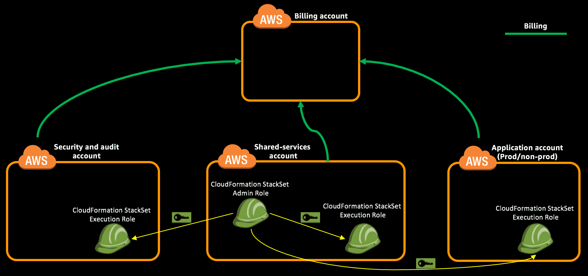

Create CloudFormation StackSet Admin IAM Role in `Shared Services` account. Create CloudFormation StackSet Execution IAM Role in `Security`, `Shared Services` and `Application One` accounts. Create

> Use **Ireland (eu-west-1)** to create all resources.

**Table of Contents:**
-   [Create IAM role required for AWS CloudFormation StackSet Administration](#create-iam-role-required-for-aws-cloudformation-stackset-administration)
-   [Create IAM role required for AWS CloudFormation StackSet Execution](#create-iam-role-required-for-aws-cloudformation-stackset-execution)
-   [Expected Outcome](expected-outcome)

## Create IAM role required for AWS CloudFormation StackSet Administration
> This should be performed in `Shared Services` Account.

1.  Login to "Shared Services Account" with **PayerAccountAccessRole** role created as part of account creation using the [cross account switch role](http://docs.aws.amazon.com/IAM/latest/UserGuide/id_roles_use_switch-role-console.html) capability.

2.  Change the region to Ireland (eu-west-1) by [selecting the region](http://docs.aws.amazon.com/awsconsolehelpdocs/latest/gsg/getting-started.html#select-region) from the top right of Management Console.

3.  Navigate to [CloudFormation](https://eu-west-1.console.aws.amazon.com/cloudformation/home?region=eu-west-1#/stacks?filter=active) console and create a new stack using [AWSCloudFormationStackSetAdministrationRole.yml](../templates/AWSCloudFormationStackSetAdministrationRole.yml) template.

**Using CLI:**
```
aws cloudformation create-stack --stack-name CFNStackSetAdminRole --template-body file://AWSCloudFormationStackSetAdministrationRole.yml --capabilities CAPABILITY_NAMED_IAM --region eu-west-1 --profile sharedserv
```
```json
{
    "StackId": "arn:aws:cloudformation:eu-west-1:321098987654:stack/CFNStackSetAdminRole/7626db50-bae3-11e7-1867-50d5cafe76fe"
}
```
## Create IAM role required for AWS CloudFormation StackSet Execution

> This should be performed in `Security`, `Shared Services` and `Application One` accounts in Ireland (eu-west-1) region.

### Create AWS CloudFormation StackSet Execution Role in Security Account
1.  Login to "Security Account" with **PayerAccountAccessRole** role created as part of account creation using the [cross account switch role](http://docs.aws.amazon.com/IAM/latest/UserGuide/id_roles_use_switch-role-console.html) capability.

2.  Change the region to Ireland (eu-west-1) by [selecting the region](http://docs.aws.amazon.com/awsconsolehelpdocs/latest/gsg/getting-started.html#select-region) from the top right of Management Console.

3.  Navigate to [CloudFormation](https://eu-west-1.console.aws.amazon.com/cloudformation/home?region=eu-west-1#/stacks?filter=active) console and create a new stack using [AWSCloudFormationStackSetExecutionRole.yml](../templates/AWSCloudFormationStackSetExecutionRole.yml) template. Provide the 12 digit AWS account ID of the Shared Services account as parameter. This stack will create an IAM role in Security account which will allow CloudFormation StackSet in Shared Services account to create stacks in Security account.

    **Using CLI:**  

    Navigate to `templates` folder which contains all the CloudFormation templates.

    Update the ParameterValue in the below command to 12 digit AWS account ID of Shared Services account.

    <code>
    aws cloudformation create-stack --stack-name CFNStackSetExecutionRole --template-body file://AWSCloudFormationStackSetExecutionRole.yml --capabilities CAPABILITY_NAMED_IAM --region eu-west-1 --profile security --parameters ParameterKey=AdministratorAccountId,ParameterValue=<b><i>321098987654</i></b>
    </code><br>
    ```json
    {
        "StackId": "arn:aws:cloudformation:us-east-1:987654321098:stack/CFNStackSetExecutionRole/28a3c090-ba80-11e7-93d4-500c3d1abad2"
    }
    ```

4.  [Create a Key Pair](http://docs.aws.amazon.com/AWSEC2/latest/UserGuide/ec2-key-pairs.html#having-ec2-create-your-key-pair) named `lz-security-kp-eu-west-1` using Amazon EC2 and store it securely. It will be needed later.

    **Using CLI:**

    Create a Key Pair using CLI and store the returned KeyMaterial securely in a file (e.g. lz-security-kp-eu-west-1). That’s the private key which will be used to login to instances.
    ```
    aws ec2 create-key-pair --region eu-west-1 --query 'KeyMaterial' --output text --key-name lz-security-kp-eu-west-1 --profile security >> lz-security-kp-eu-west-1.pem
    ```

### Create AWS CloudFormation StackSet Execution Role in Shared Services Account
1.  Login to "Shared Services Account" with **PayerAccountAccessRole** role created as part of account creation using the [cross account switch role](http://docs.aws.amazon.com/IAM/latest/UserGuide/id_roles_use_switch-role-console.html) capability.

2.  Change the region to Ireland (eu-west-1) by [selecting the region](http://docs.aws.amazon.com/awsconsolehelpdocs/latest/gsg/getting-started.html#select-region) from the top right of Management Console.

3.  Navigate to [CloudFormation](https://eu-west-1.console.aws.amazon.com/cloudformation/home?region=eu-west-1#/stacks?filter=active) console and create a new stack using [AWSCloudFormationStackSetExecutionRole.yml](../templates/AWSCloudFormationStackSetExecutionRole.yml) template. Provide the 12 digit AWS account ID of the Shared Services account as parameter. This stack will create an IAM role in Shared Services account which will allow CloudFormation StackSet in Shared Services account to create stacks in Shared Services account.

    **Using CLI:**  

    Navigate to `templates` folder which contains all the CloudFormation templates.

    Update the ParameterValue in the below command to 12 digit AWS account ID of Shared Services account.

    <code>
    aws cloudformation create-stack --stack-name CFNStackSetExecutionRole --template-body file://AWSCloudFormationStackSetExecutionRole.yml --capabilities CAPABILITY_NAMED_IAM --region eu-west-1 --profile sharedserv --parameters ParameterKey=AdministratorAccountId,ParameterValue=<b><i>321098987654</i></b>
    </code><br>
    ```json
    {
        "StackId": "arn:aws:cloudformation:us-east-1:321098987654:stack/CFNStackSetExecutionRole/28a3c090-ba80-11e7-93d4-500c3d1abad2"
    }
    ```

4.  [Create a Key Pair](http://docs.aws.amazon.com/AWSEC2/latest/UserGuide/ec2-key-pairs.html#having-ec2-create-your-key-pair) named `lz-sharedserv-kp-eu-west-1` using Amazon EC2 and store it securely. It will be needed later.

    **Using CLI:**

    Create a Key Pair using CLI and store the returned KeyMaterial securely in a file (e.g. lz-sharedserv-kp-eu-west-1). That’s the private key which will be used to login to instances.
    ```
    aws ec2 create-key-pair --region eu-west-1 --query 'KeyMaterial' --output text --key-name lz-sharedserv-kp-eu-west-1 --profile sharedserv >> lz-sharedserv-kp-eu-west-1.pem
    ```

### Create AWS CloudFormation StackSet Execution Role in Application One Account
1.  Login to "Application One Account" with **PayerAccountAccessRole** role created as part of account creation using the [cross account switch role](http://docs.aws.amazon.com/IAM/latest/UserGuide/id_roles_use_switch-role-console.html) capability.

2.  Change the region to Ireland (eu-west-1) by [selecting the region](http://docs.aws.amazon.com/awsconsolehelpdocs/latest/gsg/getting-started.html#select-region) from the top right of Management Console.

3.  Navigate to [CloudFormation](https://eu-west-1.console.aws.amazon.com/cloudformation/home?region=eu-west-1#/stacks?filter=active) console and create a new stack using [AWSCloudFormationStackSetExecutionRole.yml](../templates/AWSCloudFormationStackSetExecutionRole.yml) template. Provide the 12 digit AWS account ID of the Shared Services account as parameter. This stack will create an IAM role in Application One account which will allow CloudFormation StackSet in Shared Services account to create stacks in Application One account.

    **Using CLI:**  

    Navigate to `templates` folder which contains all the CloudFormation templates.

    Update the ParameterValue in the below command to 12 digit AWS account ID of Shared Services account.

    <code>
    aws cloudformation create-stack --stack-name CFNStackSetExecutionRole --template-body file://AWSCloudFormationStackSetExecutionRole.yml --capabilities CAPABILITY_NAMED_IAM --region eu-west-1 --profile sharedserv --parameters ParameterKey=AdministratorAccountId,ParameterValue=<b><i>321098987654</i></b>
    </code><br>
    ```json
    {
        "StackId": "arn:aws:cloudformation:us-east-1:654321987098:stack/CFNStackSetExecutionRole/28a3c090-ba80-11e7-93d4-500c3d1abad2"
    }
    ```

4.  [Create a Key Pair](http://docs.aws.amazon.com/AWSEC2/latest/UserGuide/ec2-key-pairs.html#having-ec2-create-your-key-pair) named `lz-appone-kp-eu-west-1` using Amazon EC2 and store it securely. It will be needed later.

    **Using CLI:**

    Create a Key Pair using CLI and store the returned KeyMaterial securely in a file (e.g. lz-appone-kp-eu-west-1). That’s the private key which will be used to login to instances.
    ```
    aws ec2 create-key-pair --region eu-west-1 --query 'KeyMaterial' --output text --key-name lz-appone-kp-eu-west-1 --profile appone >> lz-appone-kp-eu-west-1.pem
    ```

## Expected Outcome
*   Created CloudFormation StackSet Admin IAM role in `Shared Services` account.
*   Created CloudFormation StackSet Execution IAM role in `Security`, `Shared Services` and `Application One` accounts.
*   Created 3 EC2 key pair in Ireland region, one each in `Security`, `Shared Services` and `Application One` accounts.


