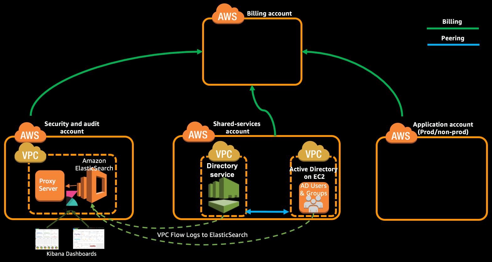

Import Kibana dashboard for centralized logging and configure it.

**Table of Contents:**
-   [Create a Basic & CloudTrail Logging Dashboard](#create-a-basic--cloudtrail-logging-dashboard)
-   [Expected Outcome](expected-outcome)

## Create a Basic & CloudTrail Logging Dashboard

1.  Login to Centralized Logging Kibana URL using the credentials saved earlier.

2.  Navigate to Settings -- Indices and create a new index ussing the following configuration.
    *   Click the checkbox named "Use event times to create index names"
    *   Leave 'Index Pattern Interval' as 'Daily'
    *   In the 'Index Name or pattern' field enter `[cwl-]YYYY.MM.DD`
    *   Select `@timestamp` for 'Time-field name' field.

3.  After creating the index, navigate to 'Objects' in the top tab.

4.  Click Import and select the saved dashboard file [logging-dashboard-with-cloudtrail.json](../LoggingDashboards/logging-dashboard-with-cloudtrail.json) located in `LoggingDashboards` directory.

5.  Once it got imported successfully, there should be 2 dashboards, 5 searches and 13 visualizations which can be validated in the Objects tab of Settings.
    > NOTE: Ignore if it throws any error (we are re-using old dashboard available in quick start).

6.  Navigate to dashboard and view the two saved dashboards 'Basic' & 'CloudTrail'.

## Expected Outcome
*   Successfully imported the saved dashboard in your Kibana instance.
*   Able to view Basic & CloudTrail dashboard in Kibana.

