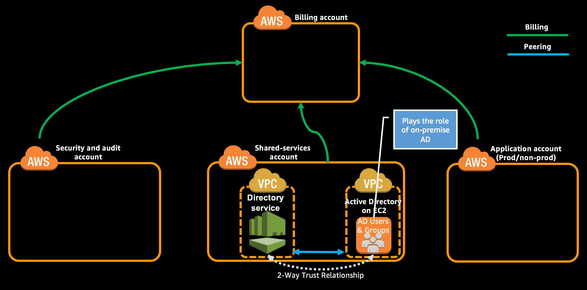

As part of this module you will login to Active Directory on EC2, create users and groups and prepare it for trust relationship. Login to Remote Desktop Gateway of DS AD and prepare it for trust relationship and establish trust relationship.

Objective of this module is to enable SSO using your existing directory in on-premise environment. For ease of lab we have created an AD on EC2 instance which shall be considered as on-premise AD. You will establish a trust relationship between your on-premise AD and AD on DS in the similar way to configure SSO.


**Table of Contents:**
-   [Login to the Remote Desktop Gateway](#login-to-the-remote-desktop-gateway)
-   [Prepare AD on EC2 for trust relationship](#prepare-ad-on-ec2-for-trust-relationship)
-   [Create trust relationship between AD on EC2 & AD on DS](#create-trust-relationship-between-ad-on-ec2--ad-on-ds)
-   [Expected Outcome](expected-outcome)


## Login to the Remote Desktop Gateway

1.  Login to "Shared Services Account" with **PayerAccountAccessRole** role created as part of account creation using the [cross account switch role](http://docs.aws.amazon.com/IAM/latest/UserGuide/id_roles_use_switch-role-console.html) capability.

2.  Change the region to Ireland (eu-west-1) by [selecting the region](http://docs.aws.amazon.com/awsconsolehelpdocs/latest/gsg/getting-started.html#select-region) from the top right of Management Console.

3.  Navigate to [CloudFormation](https://eu-west-1.console.aws.amazon.com/cloudformation/home?region=eu-west-1#/stacks?filter=active) console and select the stack that you created as part of **Create Active Directory for SSO** module (e.g. LZ-Active-Directory).

4.  From the output section use the value of key 'RemoteDesktopGatewayIP' and login to it using the RDP client. Use the the value of 'ADonDSDomainAdminUser' as username and the password you provided for parameter 'DSDomainAdminPassword' while launching the stack.

5.  Also save the value of keys 'ADDomainController1' and 'ADonDSDomainAdminUser' it will be used in the next step.

    > **Tip:**
    >
    > If you haven’t changed the password while launching the stack you shall find the value for DSDomainAdminPassword in parameter file [landing-zone-active-directories-parameters.json](../templates/landing-zone-active-directories-parameters.json)

## Prepare AD on EC2 for trust relationship

> **Note:**
>
> Domain Controllers on EC2 are in private subnet hence use the Remote Desktop Gateway as a stepping server.

1.  From within the Remote Desktop Gateway server which you have logged in the above step, launch RDP client and connect to Domain Controller 1 (DC1) with IP address from the value of key 'ADDomainController1' (e.g. 10.0.0.10).

2.  Use the value of key 'ADonDSDomainAdminUser' as the username and the password you provided for parameter 'DomainAdminPassword' while launching the stack.

    > **Tip:**
    >
    > If you haven’t changed the password while launching the stack you shall find the value for DomainAdminPassword in parameter file [landing-zone-active-directories-parameters.json](../templates/landing-zone-active-directories-parameters.json)

3.  Configure DNS Conditional Forwarders for your domain on EC2 instances as explained in [the documentation](https://docs.aws.amazon.com/directoryservice/latest/admin-guide/tutorial_setup_trust_prepare_onprem.html#tutorial_setup_trust_onprem_forwarder).

4.  Copy the directory `ADConfig` from the repo to the DC1.

5.  Open PowerShell as Administrator and navigate to the ADConfig directory that you copied in previous step.

6.  Run the script titled 'CreateUsersAndGroups.ps1'. It will create the required AD Groups.

7.  When it prompts for the password for the users to be created in AD, enter a strong password with upper case, lower case & numbers between 8 to 20 characters. It will then create the Users, add the users to appropriate group. NOTE: List of users and groups can be found in users.csv & groups.csv file.

## Create trust relationship between AD on EC2 & AD on DS

1.  Configure trust relationship at AD on EC2, by following [this tutorial](https://docs.aws.amazon.com/directoryservice/latest/admin-guide/tutorial_setup_trust_create_trust.html#tutorial_setup_trust_onprem_trust) on DC1.

2.  [Configure trust relationship at AD on DS](https://docs.aws.amazon.com/directoryservice/latest/admin-guide/tutorial_setup_trust_create_trust.html#tutorial_setup_trust_mad_trust) by providing the appropriate parameters.

    -   Remote domain name - Domain name that you have provided for AD on EC2. (If you have not changed the default value then it would be `landingzone-op.aws`).
    -   Trust password - The password that you provided in the above Step 1 while enabling trust relationship at AD on EC2.
    -   Trust direction - Select 'Two-Way'
    -   Conditional forwarder - Enter '10.0.0.10' in the first field and click "Add IP address" and in the next field enter '10.0.32.10'

**Using CLI:**

1.  Get the directory id of the directory service AD on DS using the below command. If you have changed the domain name for AD on DS, update the value to be grep’ed appropriately.
    ```
    aws ds describe-directories --region eu-west-1 --profile sharedserv --query 'DirectoryDescriptions[*].{ID:DirectoryId,Domain:Name}' --output text | grep landingzone.aws

    landingzone.aws d-9876543exp
    ```
2.  Execute the following command by providing the appropriate values for the parameters.

    -   --directory-id : Value that you obtained in previous command.
    -   --remote-domain-name : Domain name that you have provided for AD on EC2. (If you have not changed the default value then it would be `landingzone-op.aws`).
    -   --trust-password : The password that you provided while configuring trust relationship at AD on EC2.

    <code>
    $ aws ds create-trust --remote-domain-name landinzone-op.aws --trust-direction Two-Way --trust-type Forest --conditional-forwarder-ip-addrs 10.0.0.10 10.0.32.10 --region eu-west-1 --profile sharedserv --directory-id <b><i>d-9876543exp</i></b> --trust-password <b><i>securepassword</i></b>
    </code><br>

    ```json
    {
        "TrustId": "t-23963c9367"
    }
    ```

3.  Check the state of the trust by providing the correct `--directory-id` after few minutes and it should be 'Verified'.

    <code>
    aws ds describe-trusts --region eu-west-1 --profile sharedserv --query 'Trusts[&#42;].{TrustId:TrustId,State:TrustState}' --output text --directory-id <b><i>d-9876543exp</i></b>
    </code><br>

    ```
    Verified    t-23963c9367
    ```

## Expected Outcome
*   Successfully logged in Remote Desktop Gateway and EC2 Domain Controller.
*   Created DNS Conditional Forwarder in AD on EC2.
*   Created AD Groups & Users by running the PowerShell script.
*   Configured Trust Relationship in AD on EC2.
*   Configured Trust Relationship in AD on DS.
*   Successfully verified the trusted relationship.


