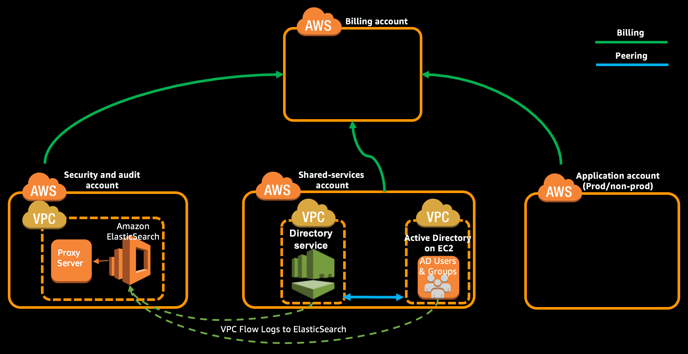

As part of this module you will launch a CloudFormation stack instance in **Shared Services account** which will enable VPC Flow logs for the VPCs and send them to Logging ElasticSearch domain.

> This should be performed on Shared Services account in **Ireland (eu-west-1)** region.

**Table of Contents:**
-   [Launch the VPC Flow Logs CloudFormation stack](#launch-the-vpc-flow-logs-cloudformation-stack)
-   [Expected Outcome](expected-outcome)

## Launch the VPC Flow Logs CloudFormation stack

1.  Login to "Shared Services Account" with **PayerAccountAccessRole** role created as part of account creation using the [cross account switch role](http://docs.aws.amazon.com/IAM/latest/UserGuide/id_roles_use_switch-role-console.html) capability.

2.  Change the region to Ireland (eu-west-1) by [selecting the region](http://docs.aws.amazon.com/awsconsolehelpdocs/latest/gsg/getting-started.html#select-region) from the top right of Management Console.

3.  Navigate to [CloudFormation](https://eu-west-1.console.aws.amazon.com/cloudformation/home?region=eu-west-1#/stacks?filter=active) console and create a new stack using [vpc-flow-logs\_instance\_logs.yml](../templates/vpc-flow-logs_instance_logs.yml) template.

4.  Provide a Stack Name, review the parameters and select appropriate values for the list mentioned below.

    -   Endpoint - Enter the valid ElasticSearch domain endpoint copied from Centralized Logging stack.
    -   MainVPCId - VPC Id of the AD on DS from Create Active Directory for SSO module.
    -   2ndVPCID - VPC Id of the AD on EC2 from Create Active Directory for SSO module.

5.  Select the checkbox under Capabilities in subsequent pages to allow CloudFormation to create IAM resources.

6.  Click the "Create" button to create the stack.

    **Using CLI:**

    *   Open [vpc-flow-logs\_instance\_logs-parameters.json](../templates/vpc-flow-logs_instance_logs-parameters.json) in your favorite text editor and review the parameters.


    * Create the stack using following command.
    ```
    aws cloudformation create-stack --stack-name ConfigureVPCFlowLogs --capabilities CAPABILITY_NAMED_IAM --region eu-west-1 --profile sharedserv --template-body file://templates/vpc-flow-logs_instance_logs.yml --parameters file://templates/vpc-flow-logs_instance_logs-parameters.json
    ```
    ```json
    {
        "StackId": "arn:aws:cloudformation:us-east-1:321098987654:stack/ConfigureVPCFlowLogs/3d1abad2-ba80-11e7-93d4-28a3c090500c"
    }
    ```

7.  Update the ElasticSearch domain access policy in **Security Account** for the domain that you created as part of the module "Configure Centralized Logging". Add additional allow statement as mentioned below to include the LogStreamerRole in Shared Services account to access the ElasticSearch in Security account.

```json
{
  "Effect": "Allow",
  "Principal": {
    "AWS": [
      "arn:aws:iam::SHARED_SERVICES_ACCOUNT_ID:role/LogStreamerRole"
    ]
  },
  "Action": "es:*",
  "Resource": "arn:aws:es:eu-west-1:SECURITY_ACCOUNT_ID:domain/YOUR_DOMAIN_NAME/*"
}
```

## Expected Outcome
*   Successfully created CloudFormation stack which configure VPC flow logs.
*   Once stack got created it should have enabled VPC flow logs for the two VPCs and send logs to ElasticSearch.
*   Create an EC2 instance and configure it to send the logs to ElasticSearch
*   Manually updated the access policy of ElasticSearch in `Security` account to allow the `LogStreamerRole` to send logs from the `Shared Services` account.


