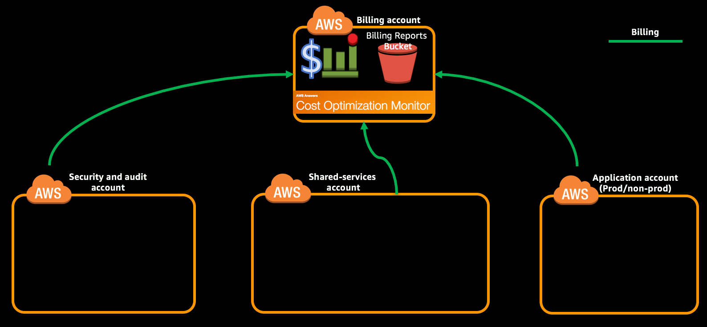

You shall launch a CloudFormation stack instance in your **Billing account** which will create a S3 Bucket, VPC and ElasticSearch cluster. You will also configure detailed billing report.

> We will not be doing this module in this lab.
>
> This should be performed on Billing account in **Ireland (eu-west-1)** region.

**Table of Contents:**
-   [Launch the Cost Optimization Monitor CloudFormation stack](#launch-the-cost-optimization-monitor-cloudformation-stack)
-   [Expected Outcome](expected-outcome)


## Launch the Cost Optimization Monitor CloudFormation stack

[Cost Optimization Monitor](https://aws.amazon.com/answers/account-management/cost-optimization-monitor/) is an AWS Solution that automatically uploads detailed billing report data to Amazon ES for analysis and visualization in the Kibana user interface.

1.  Navigate to [CloudFormation](https://eu-west-1.console.aws.amazon.com/cloudformation/home?region=eu-west-1#/stacks?filter=active) console and create a new stack using [cost-optimization-monitor.yml](../templates/cost-optimization-monitor.yml) template.

2.  Provide a Stack Name, review the parameters and select appropriate values for the list mentioned below.

    -   KeyName - Valid key pair (e.g. lz-billing-kp-us-east-1).
    -   ProxyPass - Update the passwords to a string between 6 and 41 characters containing letters, numbers and symbols.
    -   SSHLocation - CIDR IP range to which SSH access to the Proxy server and HTTP access to the Kibana ELB should be enabled. (You shall get your current address using <http://checkip.dyndns.org/>)

3.  Select the checkbox under Capabilities in subsequent pages to allow CloudFormation to create IAM resources and click Create.

    **Using CLI:**
    1.  Open [cost-optimization-monitor-parameters.json](../templates/cost-optimization-monitor-parameters.json) in your favorite text editor and review the parameters to update the following parameters.

        -   KeyName - Valid key pair (e.g. lz-master-kp-us-east-1).
        -   ProxyPass - Update the passwords to a string between 6 and 41 characters containing letters, numbers and symbols.
        -   SSHLocation - CIDR IP range to which SSH access to the Proxy server and HTTP access to the Kibana ELB should be enabled. (You shall get your current address using <http://checkip.dyndns.org/> or `curl wgetip.com`)

    2.  Create the stack using following command.

        ```
        aws cloudformation create-stack --stack-name CostOptimizationMonitor --capabilities CAPABILITY_NAMED_IAM --region eu-west-1 --profile billing --template-body file://templates/cost-optimization-monitor.yml --parameters file://templates/cost-optimization-monitor-parameters.json
        ```
        ```json
        {
            "StackId": "arn:aws:cloudformation:us-east-1:123456789012:stack/CostOptimizationMonitor/3d1abad2-93d4-ba80-11e7-28a3c090500c"
        }
        ```

4.  It will take sometime to create the CloudFormation stack but it will create the 'S3DBRBucket' faster. You shall get the name of the 'S3DBRBucket' by checking the 'Resources' tab of the CloudFormation stack.

    **Using CLI:**

    ```
    aws cloudformation describe-stack-resource --stack-name CostOptimizationMonitor --logical-resource-id S3DBRBucket --region eu-west-1 --profile billing --query 'StackResourceDetail.PhysicalResourceId'

    "costoptimizationmonitor-s3dbrbucket-seebzexample"
    ```

5.  [Configure Detailed Billing Reports to be delivered to the S3 bucket](http://docs.aws.amazon.com/solutions/latest/cost-optimization-monitor/deployment.html#step2) found in the above step.


## Expected Outcome
*   Successfully created the Cost Optimization Monitor CloudFormation stack
    -   Created a VPC
    -   Created ElasticSearch cluster in it
    -   Created proxy server in front of ElasticSearch for authentication.
*   Successfully configured the delivery of Detailed Billing Reports to S3 bucket.


