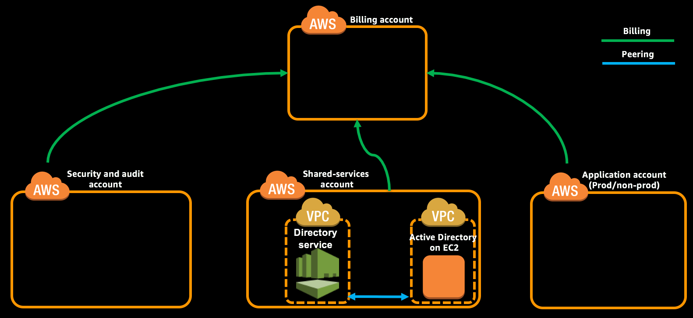

As part of this module you will launch a CloudFormation stack which will create two VPC’s, install Microsoft AD on EC2, create AWS Directory Service Microsoft AD, create Remote Desktop Gateway and establish VPC peering between the two VPC’s.

> This should be performed on Shared Services account in **Ireland (eu-west-1)** region.

**Table of Contents:**
-   [Launch the Active Directory CloudFormation stack](#launch-the-active-directory-cloudformation-stack)
-   [Expected Outcome](expected-outcome)

## Launch the Active Directory CloudFormation stack

1.  Login to "Shared Services Account" with **PayerAccountAccessRole** role created as part of account creation using the [cross account switch role](http://docs.aws.amazon.com/IAM/latest/UserGuide/id_roles_use_switch-role-console.html) capability.

2.  Change the region to Ireland (eu-west-1) by [selecting the region](http://docs.aws.amazon.com/awsconsolehelpdocs/latest/gsg/getting-started.html#select-region) from the top right of Management Console.

3.  Navigate to [CloudFormation](https://eu-west-1.console.aws.amazon.com/cloudformation/home?region=eu-west-1#/stacks?filter=active) console and create a new stack using [landing-zone-active-directories.yml](../templates/landing-zone-active-directories.yml) template.

4.  Provide a Stack Name (E.g. LZ-Active-Directory), review the following parameters.
    -   DomainAdminPassword - Must be between 8 and 32 characters containing letters, numbers and symbols

    -   RestoreModePassword - Must be between 8 and 32 characters containing letters, numbers and symbols

    -   DSDomainAdminPassword - Must be between 8 and 32 characters containing letters, numbers and symbols

    -   DSRDGWCIDR -  CIDR IP range to which the RD GW access should be enabled (You shall get your current address using <http://checkip.dyndns.org/>).

5.  Select the checkbox under Capabilities in subsequent pages to allow CloudFormation to create IAM resources.

6.  Create the stack.

> **Note:**
>
> It will take approximately 15 to 20 minutes to complete the stack creation. Proceed with the other modules and this can be followed up later.

**Using CLI:**

1.  Open [landing-zone-active-directories-parameters.json](../templates/landing-zone-active-directories-parameters.json) in your favorite text editor and review the parameters.

2.  Update the ParameterValue of the following ParameterKeys.

    -   DomainAdminPassword - Must be between 8 and 32 characters containing letters, numbers and symbols

    -   RestoreModePassword - Must be between 8 and 32 characters containing letters, numbers and symbols

    -   DSDomainAdminPassword - Must be between 8 and 32 characters containing letters, numbers and symbols

    -   DSRDGWCIDR -  CIDR IP range to which the RD GW access should be enabled (You shall get your current address using <http://checkip.dyndns.org/>).

3.  Create the stack using following command.

    ```
    aws cloudformation create-stack --stack-name LZ-Active-Directory --template-body file://templates/landing-zone-active-directories.yml --parameters file://templates/landing-zone-active-directories-parameters.json --capabilities CAPABILITY_NAMED_IAM --region eu-west-1 --profile sharedserv
    ```
    ```json
    {
        "StackId": "arn:aws:cloudformation:us-east-1:987654321098:stack/LZ-Active-Directory/3d1abad2-ba80-11e7-93d4-28a3c090500c"
    }
    ```

    You shall check the status of the stack creation using following command.
    ```
    aws cloudformation describe-stack-events --stack-name LZ-Active-Directory --region eu-west-1 --profile sharedserv --output table --query 'StackEvents[*].{LogicalId:LogicalResourceId, ResourceType: ResourceType, Status: ResourceStatus}'
    -----------------------------------------------------------------------------
    |                            DescribeStackEvents                            |
    +---------------------+------------------------------+----------------------+
    |      LogicalId      |        ResourceType          |       Status         |
    +---------------------+------------------------------+----------------------+
    |  VPCStack           |  AWS::CloudFormation::Stack  |  CREATE_IN_PROGRESS  |
    |  DSVPCStack         |  AWS::CloudFormation::Stack  |  CREATE_IN_PROGRESS  |
    |  VPCStack           |  AWS::CloudFormation::Stack  |  CREATE_IN_PROGRESS  |
    |  GetSGIDLambdaRole  |  AWS::IAM::Role              |  CREATE_IN_PROGRESS  |
    |  GetSGIDLambdaRole  |  AWS::IAM::Role              |  CREATE_IN_PROGRESS  |
    |  DSVPCStack         |  AWS::CloudFormation::Stack  |  CREATE_IN_PROGRESS  |
    |  LZ-Active-Directory|  AWS::CloudFormation::Stack  |  CREATE_IN_PROGRESS  |
    +---------------------+------------------------------+----------------------+
    ```

    > **Note:**
    >
    > It will take approximately 15 to 20 minutes to complete the stack creation. Proceed with the other modules and this can be followed up later.

    Once the stack has been created completely you shall get the output of the stack using following command.
    ```
    aws cloudformation describe-stacks --stack-name LZ-Active-Directory --region eu-west-1 --profile sharedserv --query 'Stacks[0].Outputs[*].{Key:OutputKey, Value:OutputValue}' --output table
    ---------------------------------------------------------
    |                    DescribeStacks                     |
    +-------------------------+-----------------------------+
    |           Key           |            Value            |
    +-------------------------+-----------------------------+
    |  ADonEC2DomainAdminUser |  landingzone-op\StackAdmin  |
    |  ADonDSDomainAdminUser  |  landingzone\admin          |
    |  ADonEC2VPCId           |  vpc-854d73e2               |
    |  RemoteDesktopGatewayIP |  52.214.170.27              |
    |  ADDomainController2    |  10.0.32.10                 |
    |  DSVPCId                |  vpc-c04a74a7               |
    |  ADDomainController1    |  10.0.0.10                  |
    +-------------------------+-----------------------------+
    ```

## Expected Outcome

After the stack got created completely.
*   Created VPC for AD on EC2
*   Created 2 Domain Controllers in EC2
*   Created VPC for AD on Directory Service (DS).
*   Created 1 Directory of type Microsoft AD in AWS Directory Service.
*   Created 1 Remote Desktop Gateway in VPC for AD on DS.
*   Created VPC peering and enabled between AD on EC2 and AD on DS.


