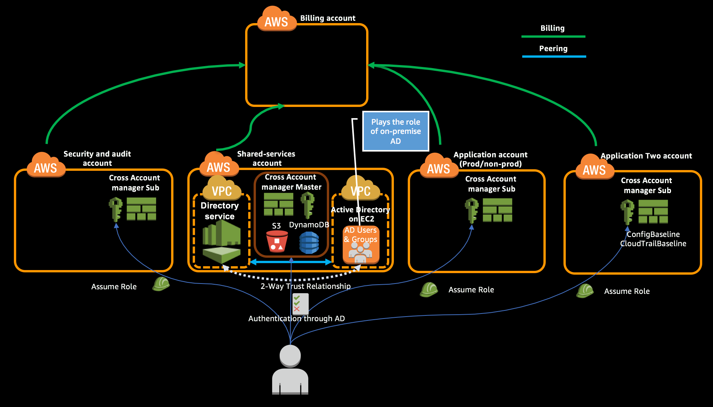

Create an AWS account for application two and on-board that account as part of Cross Account Manager.

> Use **North Virginia (us-east-1)** region in Billing account.
> Use **Ireland (eu-west-1)** to create all resources in Shared Services account.

**Table of Contents:**
-   [Create an AWS accounts](#create-an-aws-accounts)
-   [Move accounts under corresponding Organizational Units](#move-accounts-under-corresponding-organizational-units)
-   [Configure Cross Account access through Assume Role](#configure-cross-account-access-through-assume-role)
-   [Create IAM role required for AWS CloudFormation StackSet Execution](#create-iam-role-required-for-aws-cloudformation-stackset-execution)
-   [Configure Application Two account in Cross Account Manager Master](#configure-application-two-account-in-cross-account-manager-master)
-   [Update the Cross Account Manager Sub stack set](#update-the-cross-account-manager-sub-stack-set)
-   [Implement Config baseline in Application Two account](#implement-config-baseline-in-application-two-account)
-   [Implement CloudTrail baseline in Application Two account](#implement-cloudtrail-baseline-in-application-two-account)
-   [Use the solution webpage to access a sub-account](#use-the-solution-webpage-to-access-a-sub-account)
-   [Expected Outcome](#expected-outcome)


## Create an AWS accounts

> This should be performed on Billing Account in North Virginia (us-east-1) region.
>
> **Tip:**
>
> Each AWS account that you create requires an unique email address. For ease of use, most mail servers ignores the characters after a plus sign `+`. You shall add strings like `+lzapptwo` to your existing email address to get unique email address, still the mails will get delivered to the same mailbox as the original email.  
>   
> E.g. If your email address is `noreply@example.com`, you shall use `noreply+lzapptwo@example.com` while creating the account and it will deliver the emails to `noreply@example.com` mailbox.  
>   
> Check whether your mail server supports this capability by sending a test email. If it doesn’t support this capability then you need to create unique email address for each account that you are creating.

1.  Navigate to Accounts tab of AWS Organizations console.

2.  Click ‘Add Account’ followed by [‘Create Account’](http://docs.aws.amazon.com/organizations/latest/userguide/orgs_manage_accounts_create.html).

3.  Create a new Application Two account by entering the following details.

    *   Full Name – Enter a name (e.g. Application Two Account)
    *   Email Address – Valid unique email address (e.g. noreply+lzapptwo@example.com)
    *   IAM role name – Admin IAM role which the appropriate user in Billing account can assume. Name it **PayerAccountAccessRole** for all the accounts you are creating under the Master account.

    **Using CLI:**

    Update the --email parameter to appropriate email address and run the command.

    <code> aws organizations create-account --account-name "Application Two Account"  --role-name PayerAccountAccessRole --iam-user-access-to-billing ALLOW --region us-east-1 --profile billing --email <b><i>noreply+lzapptwo@example.com</i></b>
    </code><br>

    ```json
            {
                "CreateAccountStatus": {
                    "RequestedTimestamp": 1508943783.375,
                    "State": "IN_PROGRESS",
                    "Id": "car-77558640b99511e78c88511c44cd49c5",
                    "AccountName": "Application Two Account"
                }
            }
    ```

## Move accounts under corresponding Organizational Units

> This should be performed on Billing Account in North Virginia (us-east-1) region.

1.  Navigate to 'Organize Accounts' tab in AWS Organizations console, which will display all the accounts under your organization.

    **Using CLI**  

    Get the 12 digit AWS account Ids of the 'Application Two' accounts.

    ```
    aws organizations list-accounts --region us-east-1 --profile billing --query 'Accounts[?Name==`Application Two Account`].{Name:Name,Email:Email,AccountId:Id}' --output table

    ---------------------------------------------------------------------------
    |                              ListAccounts                               |
    +--------------+------------------------------+---------------------------+
    |   AccountId  |            Email             |           Name            |
    +--------------+------------------------------+---------------------------+
    |  123450987609| noreply+lzapptwo@example.com |  Application Two Account  |
    +--------------+------------------------------+---------------------------+
    ```

2.  Move 'Application Two' accounts to Applications OU.

    **Using CLI**

    Provide the 12 digit account id of Application Two for `--account-id` parameter, provide the ID of the organization (e.g. r-abcd) for `--source-parent-id` parameter and ID of the Applications OU (e.g. ou-abcd-7rapptwo) for `--destination-parent-id`.

    <code>
    aws organizations move-account --region us-east-1 --profile billing --account-id <b><i>123450987609</i></b> --source-parent-id <b><i>r-abcd</i></b> --destination-parent-id <b><i>ou-abcd-7rapptwo</i></b>
    </code>

    Check whether the account got moved successfully.

    <code>
    aws organizations list-accounts-for-parent --region us-east-1 --profile billing --query 'Accounts[&#42;].{Name:Name,Email:Email,Id:Id,Status:Status}' --output table --parent-id <b><i>ou-abcd-7rapptwo</i></b>
    </code>

    ```
    --------------------------------------------------------------------------------------
    |                                ListAccountsForParent                               |
    +------------------------------+---------------+---------------------------+---------+
    |             Email            |      Id       |           Name            | Status  |
    +------------------------------+---------------+---------------------------+---------+
    | noreply+lzapp1@example.com   |  654321987098 |  Application One Account  |  ACTIVE |
    | noreply+lzapptwo@example.com |  123450987609 |  Application Two Account  |  ACTIVE |
    +------------------------------+---------------+---------------------------+---------+
    ```

## Configure Cross Account access through Assume Role

Update the AWS CLI configuration file `~/.aws/config` in your workstation with the details of the Application Two account to perform [cross account assume role](http://docs.aws.amazon.com/cli/latest/userguide/cli-roles.html) using the ARN of the role (`PayerAccountAccessRole`) created in each account.

*Example:*

```
~/.aws/config
[profile billing]
region=us-east-1
output=json

[profile security]
role_arn = arn:aws:iam::987654321098:role/PayerAccountAccessRole
source_profile = billing
region=eu-west-1
output=json

[profile sharedserv]
role_arn = arn:aws:iam::321098987654:role/PayerAccountAccessRole
source_profile = billing
region=eu-west-1
output=json

[profile appone]
role_arn = arn:aws:iam::654321987098:role/PayerAccountAccessRole
source_profile = billing
region=eu-west-1
output=json

[profile apptwo]
role_arn = arn:aws:iam::123450987609:role/PayerAccountAccessRole
source_profile = billing
region=eu-west-1
output=json
```

You shall use the above snippet and update the appropriate Account ID in the role\_arn.

## Create IAM role required for AWS CloudFormation StackSet Execution

> This should be performed in Ireland (eu-west-1) region.

1.  Login to "Application Two Account" with **PayerAccountAccessRole** role created as part of account creation using the [cross account switch role](http://docs.aws.amazon.com/IAM/latest/UserGuide/id_roles_use_switch-role-console.html) capability.

2.  Change the region to Ireland (eu-west-1) by [selecting the region](http://docs.aws.amazon.com/awsconsolehelpdocs/latest/gsg/getting-started.html#select-region) from the top right of Management Console.

3.  Navigate to [CloudFormation](https://eu-west-1.console.aws.amazon.com/cloudformation/home?region=eu-west-1#/stacks?filter=active) console and create a new stack using [AWSCloudFormationStackSetExecutionRole.yml](../templates/AWSCloudFormationStackSetExecutionRole.yml) template. Provide the 12 digit AWS account ID of the Shared Services account as parameter. This stack will create an IAM role in Application Two account which will allow CloudFormation StackSet in Shared Services account to create stacks in Application Two account.

    **Using CLI:**

    Update the ParameterValue in the below command to 12 digit AWS account ID of Shared Services account.

    <code>aws cloudformation create-stack --stack-name CFNStackSetExecutionRole --template-body file://templates/AWSCloudFormationStackSetExecutionRole.yml --capabilities CAPABILITY_NAMED_IAM --region eu-west-1 --profile apptwo --parameters ParameterKey=AdministratorAccountId,ParameterValue=<b><i>321098987654</i></b>
    </code><br>

    ```json
    {
        "StackId": "arn:aws:cloudformation:us-east-1:123450987609:stack/CFNStackSetExecutionRole/28a3c090-ba80-11e7-93d4-500c3d1abad2"
    }
    ```

## Configure Application Two account in Cross Account Manager Master

> This should be performed on Shared Services Account in Ireland (eu-west-1) region.

1.  Open the file [account.yml](../CrossAccountManager/account.yml) which located inside CrossAccountManager directory in your favorite text editor.

2.  Add additional account with the 12 digit account id of your `Application Two` account, and also include 'accountgroup' as 'devops' and save the file.

3.  Navigate to [Amazon S3 Console](https://s3.console.aws.amazon.com/s3/home?region=eu-west-1#) and open the 'ConfigBucket' bucket that was created in the previous procedure and open the `account` folder.

4.  Upload the account file. In the upload pop-up at 'Set Properties' stage, under 'Encryption' select the check box 'AWS KMS master-key' and use the solution-generated AWS KMS key to encrypt the object during upload (see the [AWS KMS Developer Guide](http://docs.aws.amazon.com/kms/latest/developerguide/services-s3.html) for detailed instructions).

    **Using CLI:**

    *   Upload the account.yml file inside CrossAccountManager directory to the 'account' directory in `CAMConfigBucket` S3 bucket. Update the S3 location & `--sse-kms-key-id` parameter to the value obtained as part of Cross Account Manager module.

        <code>aws s3 cp --region eu-west-1 --profile sharedserv --sse aws:kms account.yml s3://<b><i>lz-cross-account-manager-config-example</i></b>/account/ --sse-kms-key-id <b><i>b44a4526-abcd-0707-wxyz-e299c63423da</i></b>
        </code><br>

        ```
        upload: ./account.yml to s3://lz-cross-account-manager-config-example/account/account.yml
        ```

5.  If the upload is successful, the solution will remove the account file from the configuration bucket. Check the account folder to confirm the file was received and removed. (It will remain in the bucket’s version history.) You can also check [Amazon DynamoDB](http://docs.aws.amazon.com/solutions/latest/cross-account-manager/appendix-a.html#ddb-tables) to confirm the account record(s) were added successfully.

    **Using CLI:**

    -   Scan the accounts DynamoDB table to see whether the accounts got added.

        ```
        aws dynamodb scan --table-name CrossAccountManager-Accounts --region eu-west-1 --profile sharedserv --query 'Items[*].{AccountId:AccountId.S,AccountGroup:AccountGroup.S,Status:Status.S}' --output table

        ---------------------------------------------
        |                   Scan                    |
        +---------------+----------------+----------+
        | AccountGroup  |   AccountId    | Status   |
        +---------------+----------------+----------+
        |               |  987654321098  |  active  |
        |  devops       |  654321987098  |  active  |
        |  devops       |  123450987609  |  pending |
        +---------------+----------------+----------+
        ```

    > You must successfully upload the account file to the configuration bucket before you continue to the next step.

## Update the Cross Account Manager Sub stack set

> This should be performed on Shared Services Account in Ireland (eu-west-1) region.

Update the CrossAccountManager StackSet to include the Application Two account. 1. Navigate to [CloudFormation StackSets](https://eu-west-1.console.aws.amazon.com/cloudformation/stacksets/home?region=eu-west-1#/stacksets) console. 2. Click the StackSet Name `CrossAccountManager` which will open the StackSet. 3. Click `Manage StackSet` button in the top right corner. Under 'Select Action', select 'Create Stacks' and click Next. 4. Enter the 12 digit account ID of `Application Two` account in 'Create stacks in accounts' field. 5. Add 'EU (Ireland)' in the 'Specify Regions' field. Don’t change anything in 'Set Overrides' and proceed by clicking Next. 6. In the review page, select the checkbox to acknowledge the creation of IAM resources and click `Create Stacks` to create the CrossAccountManager Sub roles in Application Two account.

**Using CLI:**

1.  Create Stack Instance for `Application Two` account by providing the 12 digit AWS account id of the account to `--accounts` parameter.

    <code>aws cloudformation create-stack-instances --stack-set-name CrossAccountManager --regions eu-west-1 --operation-preferences FailureToleranceCount=0,MaxConcurrentCount=1 --region eu-west-1 --profile sharedserv --accounts <b><i>123450987609</i></b>
    </code><br>

    ```json
        {
            "OperationId": "999a05b3-adef-4692-356a-695bfexample"
        }
    ```

## Implement Config baseline in Application Two account

> This should be performed on Shared Services Account in Ireland (eu-west-1) region.

1.  Navigate to [CloudFormation StackSets](https://eu-west-1.console.aws.amazon.com/cloudformation/stacksets/home?region=eu-west-1#/stacksets) console.

2.  Click the StackSet Name `ConfigBaseline` which will open the StackSet.

3.  Click `Manage StackSet` button in the top right corner. Under 'Select Action', select 'Create Stacks' and click Next.

4.  Enter the 12 digit account ID of `Application Two` account in 'Create stacks in accounts' field.

5.  Add 'EU (Ireland)' in the 'Specify Regions' field. Don’t change anything in 'Set Overrides' and proceed by clicking Next.

6.  In the review page, select the checkbox to acknowledge the creation of IAM resources and click `Create Stacks` to create the ConfigBaseline stack instance in Application Two account.

**Using CLI:**

Create Stack Instance for `Application Two` account by providing the 12 digit AWS account id of the account to `--accounts` parameter.

<code>aws cloudformation create-stack-instances --stack-set-name ConfigBaseline --regions eu-west-1 --operation-preferences FailureToleranceCount=0,MaxConcurrentCount=1 --region eu-west-1 --profile sharedserv --accounts <b><i>123450987609</i></b>
</code><br>

```json
{
    "OperationId": "999a05b3-adef-4692-356a-695bfexample"
}
```


## Implement CloudTrail baseline in Application Two account

> This should be performed on Shared Services Account in Ireland (eu-west-1) region.

1.  Navigate to [CloudFormation StackSets](https://eu-west-1.console.aws.amazon.com/cloudformation/stacksets/home?region=eu-west-1#/stacksets) console.

2.  Click the StackSet Name `CloudTrailBaseline` which will open the StackSet.

3.  Click `Manage StackSet` button in the top right corner. Under 'Select Action', select 'Create Stacks' and click Next.

4.  Enter the 12 digit account ID of `Application Two` account in 'Create stacks in accounts' field.

5.  Add 'EU (Ireland)' in the 'Specify Regions' field. Don’t change anything in 'Set Overrides' and proceed by clicking Next.

6.  In the review page, select the checkbox to acknowledge the creation of IAM resources and click `Create Stacks` to create the CloudTrailBaseline stack instance in Application Two account.

**Using CLI:**

Create Stack Instance for `Application Two` account by providing the 12 digit AWS account id of the account to `--accounts` parameter.

<code>aws cloudformation create-stack-instances --stack-set-name CloudTrailBaseline --regions eu-west-1 --operation-preferences FailureToleranceCount=0,MaxConcurrentCount=1 --region eu-west-1 --profile sharedserv --accounts <b><i>123450987609</i></b>
</code><br>

```json
{
    "OperationId": "999a05b3-adef-4692-356a-695bfexample"
}
```


## Use the solution webpage to access a sub-account

1.  Append '/console' to the access URL you have created as part of Step 1 of the previous procedure. (e.g. <https://lz-example.awsapps.com/console/>).

2.  Login using the domain username (e.g. AdminUser) & password (e.g. p@ssw0rd+).

3.  The login screen contains a drop-down field of all roles assigned to your user identity. Select the role you want to use to log in to solution. This role will determine the sub-accounts you can access.

4.  This takes you to the AWS Management Console. Open the Amazon S3 console.

5.  Select the Amazon S3 bucket that hosts the webpage of access links. ('AccessLinksBucket' that you created using CloudFormation in the beginning of this module).

6.  Choose the webpage (cross-account-manager-links.html) to go to the detail page, and choose Open. This will open a webpage that contains access links for all managed accounts.

7.  The webpage links are organized by role. You should see the Application Two account also in the list, click the link to the appropriate role.

    > **Note**
    >
    > The solution webpage will show all sub-accounts that the solution manages, not just the accounts your role(s) has access to. If you try to access a sub-account that is not authorized for your role, the switch role window will show an authorization error.

8.  Choose Switch Role to open the AWS Management Console for the Application Two account. The account will switch automatically.


## Expected Outcome
*   Created a new AWS account for `Application Two` in Organization.
*   Moved that Organization under `Applications` OU.
*   Updated the AWS CLI config to enable Cross Account Access to `Application Two` account using role.
*   Created CloudFormation StackSet Execution role.
*   Updated the `account.yml` file with the `Application Two` account and successfully uploaded to the config S3 bucket.
*   Account got acceded successfully in the DynamoDB table `CrossAccountManager-Accounts`
*   Successfully on-boarded `Application Two` account into `CrossAccountManager` by adding it to the StackSet in `Shared Services` account.
*   Successfully implemented Config Baseline by adding `Application Two` to the 'ConfigBaseline' StackSet in `Shared Services` account.
*   Successfully implemented CloudTrail Baseline by adding `Application Two` to the 'CloudTrailBaseline' StackSet in `Shared Services` account.
*   Successfully login to `Application Two` account using AD User through Access Links URL.


