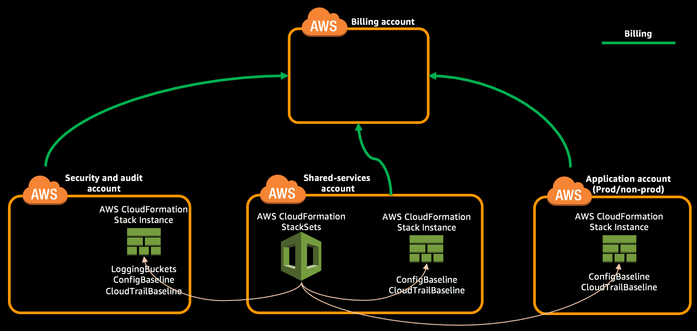

As part of this module you will launch a CloudFormation stack in Security account through CloudFormation StackSet to create logging buckets. Then launch CloudFormation StackSet for IAM baseline, Config baseline and CloudTrail baseline, which will create corresponding CloudFormation stacks in all the accounts.

> This should be performed on Shared Services account in **Ireland (eu-west-1)** region.

**Table of Contents:**
-   [Create logging buckets](#create-logging-buckets)
-   [Get the name of the logging buckets](#get-the-name-of-the-logging-buckets)
-   [Create Config Baseline](#create-config-baseline)
-   [Create CloudTrail Baseline](#create-cloudtrail-baseline)
-   [Get the CloudTrail LogGroup in Security account](#get-the-cloudTrail-loggroup-in-security-account)
-   [Expected Outcome](expected-outcome)


## Create logging buckets

1.  Login to "Shared Services Account" with **PayerAccountAccessRole** role created as part of account creation using the [cross account switch role](http://docs.aws.amazon.com/IAM/latest/UserGuide/id_roles_use_switch-role-console.html) capability.

2.  Change the region to Ireland (eu-west-1) by [selecting the region](http://docs.aws.amazon.com/awsconsolehelpdocs/latest/gsg/getting-started.html#select-region) from the top right of Management Console.

3.  Navigate to [CloudFormation StackSets](https://eu-west-1.console.aws.amazon.com/cloudformation/stacksets/home?region=eu-west-1#/stacksets) console and create a new StackSet using [logging-buckets.yml](../templates/logging-buckets.yml) template.

4.  Provide the StackSet Name `LoggingBuckets`, then enter 'true' for pSupportsGlacier parameter and proceed by clicking 'Next'.

5.  Enter the 12 digit account ID of `Security` account under 'Deploy stacks in accounts' field.

6.  Add 'EU (Ireland)' in the 'Specify Regions' field.

7.  Proceed by clicking 'Next' and create the StackSet.

**Using CLI:**

1.  Move into the directory named templates which contains the CloudFormation templates and parameters file.

2.  Create the StackSet named `LoggingBuckets` using following command.
    ```
    aws cloudformation create-stack-set --stack-set-name LoggingBuckets --template-body file://logging-buckets.yml --parameters ParameterKey=pSupportsGlacier,ParameterValue=true --region eu-west-1 --profile sharedserv
    ```
    ```json
    {
        "StackSetId": "LoggingBuckets:5c54daa1-9155-4d84-6cfc-9b1fdb47bc13"
    }
    ```

3.  Create Stack Instance in `Security` account by providing the 12 digit AWS account id of Security account to `--accounts` parameter.

    <code>
    aws cloudformation create-stack-instances --stack-set-name LoggingBuckets --regions eu-west-1 --operation-preferences FailureToleranceCount=0,MaxConcurrentCount=1 --region eu-west-1 --profile sharedserv --accounts <b><i>987654321098</i></b>
    </code><br>

    ```json
    {
        "OperationId": "666a05b3-adef-4692-356a-695bf702678b"
    }
    ```

## Get the name of the logging buckets

1.  Login to "Shared Services Account" with **PayerAccountAccessRole** role created as part of account creation using the [cross account switch role](http://docs.aws.amazon.com/IAM/latest/UserGuide/id_roles_use_switch-role-console.html) capability.

2.  Change the region to Ireland (eu-west-1) by [selecting the region](http://docs.aws.amazon.com/awsconsolehelpdocs/latest/gsg/getting-started.html#select-region) from the top right of Management Console.

3.  Navigate to [CloudFormation StackSets](https://eu-west-1.console.aws.amazon.com/cloudformation/stacksets/home?region=eu-west-1#/stacksets) console and select the StackSet named "LoggingBuckets". Under the "Stacks" field you will find the name of the stack that got created in "Security Account", copy that name.

    **Using CLI:**

    Run the following query by updating the 12 digit account number to your 'Security' account Id.

    <code>
    aws cloudformation list-stack-instances --stack-set-name LoggingBuckets --region eu-west-1 --profile sharedserv --query 'Summaries[?Account==&#96;"<b><i>987654321098</i></b>"&#96;] | [0].StackId' | awk -F'/' '{print $2}'
    </code><br>

    It will return the name of the stack that got created in the 'Security' account.
    ```
    StackSet-702a85d4-966f-485f-4b55-3acf74b5a950
    ```

4.  [Switch Role](http://docs.aws.amazon.com/IAM/latest/UserGuide/id_roles_use_switch-role-console.html) to "Security Account" and CloudFormation console in Ireland region.

5.  Enter the name of the stack copied in Step 3 and select that stack.

    **Using CLI:**
    Run the following query by updating the `--stack-name` parameter by copying the value from Step 3. It will return the name of the S3 buckets.

    <code>
    aws cloudformation describe-stacks --region eu-west-1 --profile security --query 'Stacks[0].Outputs[&#42;]' --output table --stack-name <b><i>StackSet-702a85d4-966f-485f-4b55-3acf74b5a950</i></b>
    </code><br>


    ```
    ---------------------------------------------------------------------------
    |                             DescribeStacks                              |
    +---------------------+---------------------------------------------------+
    |      OutputKey      |                    OutputValue                    |
    +---------------------+---------------------------------------------------+
    |  rArchiveLogsBucket |  loggingbuckets-rarchivelogsbucket-1hbnk9lbs8zoi  |
    |  rConfigBucket      |  loggingbuckets-rconfigbucket-1i8mx77l2q7zu       |
    |  rCloudTrailBucket  |  loggingbuckets-rcloudtrailbucket-1wptlk7qpuzhb   |
    +---------------------+---------------------------------------------------+
    ```
6.  Save the values of `rConfigBucket` and `rCloudTrailBucket` from the Outputs section in the `ResourcesList.txt` file, it will be needed later.


## Create Config Baseline

> This should be performed on Shared Services account in Ireland region.

1.  Navigate to [CloudFormation StackSets](https://eu-west-1.console.aws.amazon.com/cloudformation/stacksets/home?region=eu-west-1#/stacksets) console and create a new StackSet using [config-baseline.yml](../templates/config-baseline.yml) template.

2.  Provide the StackSet Name `ConfigBaseline`, then enter the config bucket (rConfigBucket) saved earlier in this module as value for *BucketName* parameter and and proceed by clicking 'Next'.

3.  Enter the 12 digit account ID of `Security`, `Shared Services` and `Application One` accounts as comma separated under 'Deploy stacks in accounts' field.

4.  Add 'EU (Ireland)' in the 'Specify Regions' field.

5.  Proceed by clicking 'Next', in the review page under 'Capabilities' click the check box to acknowledge the creation of IAM resources and create the StackSet.

**Using CLI:**

1.  Move into the directory named templates (if you are not already in there) which contains the CloudFormation templates and parameters file.

2.  Create the StackSet named `ConfigBaseline` using following command and update the parameter value to appropriate config logging bucket name saved earlier in this module.
    <code>
        aws cloudformation create-stack-set --stack-set-name ConfigBaseline --capabilities CAPABILITY_NAMED_IAM --template-body file://config-baseline.yml --region eu-west-1 --profile sharedserv --parameters ParameterKey=BucketName,ParameterValue=<b><i>loggingbuckets-rconfigbucket-l2q7zuexample</i></b>
    </code><br>

    ```json
    {
        "StackSetId": "ConfigBaseline:5c54daa1-9155-4d84-6cfc-9b1fdexample"
    }
    ```

3.  Create Stack Instance in `Security`, `Shared Services` and `Application One` accounts by providing the 12 digit AWS account id of all the accounts in space separated format to `--accounts` parameter.
    <code>
        aws cloudformation create-stack-instances --stack-set-name ConfigBaseline --regions eu-west-1 --operation-preferences FailureToleranceCount=0,MaxConcurrentCount=4 --region eu-west-1 --profile sharedserv --accounts <b><i>987654321098 321098987654 654321987098</i></b>
    </code><br>

    ```json
    {
        "OperationId": "666a05b3-adef-4692-356a-695bfexample"
    }
    ```

## Create CloudTrail Baseline

> This should be performed on Shared Services account in Ireland region.

1.  Navigate to [CloudFormation StackSets](https://eu-west-1.console.aws.amazon.com/cloudformation/stacksets/home?region=eu-west-1#/stacksets) console and create a new StackSet using [cloudtrail-baseline.yml](../templates/cloudtrail-baseline.yml) template.

2.  Provide the StackSet Name `CloudTrailBaseline`, then enter the CloudTrail bucket name (rCloudTrailBucket) saved earlier in this module as value for *pCloudTrailBucketName* parameter, enter your email to which you want to receive CloudTrail alerts for *pNotifyEmail* parameter and and proceed by clicking 'Next'.

3.  Enter the 12 digit account ID of `Security`, `Shared Services` and `Application One` accounts as comma separated under 'Deploy stacks in accounts' field.

4.  Add 'EU (Ireland)' in the 'Specify Regions' field.

5.  Proceed by clicking 'Next', in the review page under 'Capabilities' click the check box to acknowledge the creation of IAM resources and create the StackSet.

6.  Get the name of CloudTrailBaseline stack instance created in 'Security' account as part of the above step.

**Using CLI:**

1.  Move into the directory named templates (if you are not already in there) which contains the CloudFormation templates and parameters file.

2.  Open [cloudtrail-baseline-parameters.json](../templates/cloudtrail-baseline-parameters.json) in your favorite text editor and review the parameters.

3.  Update the ParameterValue of the following ParameterKeys.
    -   pCloudTrailBucketName - Enter the name of S3 bucket created as part of LoggingBuckets stack and the value (rCloudTrailBucket) obtained from the output of that stack.
    -   pNotifyEmail - Enter your email to which you want to receive CloudTrail alerts

4.  Create the StackSet named `CloudTrailBaseline` using following command.
    ```
        aws cloudformation create-stack-set  --region eu-west-1 --profile sharedserv --stack-set-name CloudTrailBaseline --capabilities CAPABILITY_NAMED_IAM --template-body file://cloudtrail-baseline.yml --parameters file://cloudtrail-baseline-parameters.json
    ```
    ```json
    {
        "StackSetId": "CloudTrailBaseline:5c54daa1-9155-4d84-6cfc-9b1fdexample"
    }
    ```

5.  Create Stack Instance in `Billing`, `Security`, `Shared Services` and `Application One` accounts by providing the 12 digit AWS account id of all the accounts in space separated format to `--accounts` parameter.
    <code>
    aws cloudformation create-stack-instances --stack-set-name CloudTrailBaseline --regions eu-west-1 --operation-preferences FailureToleranceCount=0,MaxConcurrentCount=4 --region eu-west-1 --profile sharedserv --accounts <b><i>987654321098 321098987654 654321987098</i></b>
    </code><br>

    ```json
    {
        "OperationId": "666a05b3-adef-4692-356a-695bfexample"
    }
    ```

6.  Get the name of CloudTrailBaseline stack instance created in 'Security' account as part of the above step. Update the account number in below command to your security account id.

    <code>
    aws cloudformation list-stack-instances --region eu-west-1 --profile sharedserv --stack-set-name CloudTrailBaseline --query 'Summaries[?Account==&#96;"<b><i>987654321098</i></b>"&#96;].StackId' --output text | awk -F'/' '{print $2}'
    </code><br>
    ```
    StackSet-1feaf7a6-44bb-a3c8-970d-f06a7e0d2273
    ```

## Get the CloudTrail LogGroup in Security account

1.  Login to "Security Account" with **PayerAccountAccessRole** role created as part of account creation using the [cross account switch role](http://docs.aws.amazon.com/IAM/latest/UserGuide/id_roles_use_switch-role-console.html) capability.

2.  Change the region to Ireland (eu-west-1) by [selecting the region](http://docs.aws.amazon.com/awsconsolehelpdocs/latest/gsg/getting-started.html#select-region) from the top right of Management Console.

3.  Navigate to [CloudFormation](https://eu-west-1.console.aws.amazon.com/cloudformation/home?region=eu-west-1#/stacks?filter=active) console and search for the stack name which we found in the previous section at step 6.

4.  Get the value of `rCloudTrailLogGroup` from the output section of the stack and save it in `ResourcesList.txt`

    **Using CLI:***

    <code>
    aws cloudformation describe-stacks --region eu-west-1 --profile security --query 'Stacks[0].Outputs[?OutputKey==&#96;"<b><i>rCloudTrailLogGroup</i></b>"&#96;].OutputValue' --output text --stack-name <b><i>StackSet-1feaf7a6-44bb-a3c8-970d-f06a7e0d2273</i></b>
    </code><br>
    ```
    StackSet-1feaf7a6-44bb-a3c8-970d-f06a7e0d2273-rCloudTrailLogGroup-1J14REXAMPLE
    ```

## Expected Outcome

After the stack got created completely.
*   Created LoggingBuckets stack instance in `Security` account using CloudFormation StackSets.
*   Created ConfigBaseline stack instances in `Security`, `Shared Services` and `Application One` accounts.
*   Created CloudTrailBaseline stack instances in `Security`, `Shared Services` and `Application One` accounts.
*   Obtained the name of CloudTrail LogGroup in `Security` account


